```{r}
#| label: slide1

# Dependências dos slides/aula
library(knitr)          # CRAN v1.33
library(rmarkdown)      # CRAN v2.10
library(xaringan)       # CRAN v0.22
library(xaringanthemer) # CRAN v0.3.0
library(xaringanExtra)  # [github::gadenbuie/xaringanExtra] v0.5.5
library(RefManageR)     # CRAN v1.3.0
library(ggplot2)        # CRAN v3.3.5
library(fontawesome)    # [github::rstudio/fontawesome] v0.1.0
library(pagedown)
library(dplyr)
library(ggimage)
library(ggtext)
library(glue)
library(reshape2)
library(scales)
library(reticulate)

# Usa o Python do sistema (ja tem pandas/plotnine instalados) em vez do
# ambiente gerenciado padrao do reticulate (que vem sem pacotes)
reticulate::use_python("C:/Users/Lenovo/AppData/Local/Programs/Python/Python314/python.exe", required = TRUE)

# Opções de chunks (echo/warning/message/fig-width/fig-height/fig-align valem
# para todos os slides; cada chunk individual so precisa do #| label)
# dev.args com bg="transparent" faz os PNGs saírem sem fundo branco, para
# combinar com o fundo cinza-lavanda (#E9EAF0) do tema dos slides.
options(htmltools.dir.version = FALSE)
knitr::opts_chunk$set(
  echo       = FALSE,
  warning    = FALSE,
  message    = FALSE,
  fig.retina = 3,
  fig.width  = 16,
  fig.height = 8,
  out.width  = "100%",
  fig.align  = "center",
  comment    = "#",
  dev.args   = list(bg = "transparent")
  )

# Tema para remover o fundo branco dos gráficos ggplot (o dev.args acima cuida
# do dispositivo PNG, mas o ggplot ainda pinta seu proprio fundo por cima)
tema_transparente <- theme(
  plot.background   = element_rect(fill = "transparent", colour = NA),
  panel.background  = element_rect(fill = "transparent", colour = NA),
  legend.background = element_rect(fill = "transparent", colour = NA),
  legend.key        = element_rect(fill = "transparent", colour = NA)
  )

# Cores para gráficos
colors <- c(
  blue       = "#282f6b",
  red        = "#b22200",
  yellow     = "#eace3f",
  green      = "#224f20",
  purple     = "#5f487c",
  orange     = "#b35c1e",
  turquoise  = "#419391",
  green_two  = "#839c56",
  light_blue = "#3b89bc",
  gray       = "#666666"
  )
```

## HÁ DOIS ANOS, A CONVERSA ERA OUTRA

<br>

::: {.incremental}
- **2022-2023** — Chatbots de IA generativa (ChatGPT e similares): perguntar e receber texto.
- **2024** — Assistentes multimodais: leem imagem, planilha, PDF; ainda dependiam do usuário copiar e colar.
- No evento do **Dia do Economista de 2024**, a discussão girou em torno de **conversar** com a IA: fazer boa pergunta, receber boa resposta.
- "Engenharia de Prompt".
- A IA generativa chamava a atencão, com o ChatGPT e o Gemini.
- Mostramos, na palestra de 2024, ferramentas que ficaram obsoletas.
:::

## FERRAMENTAS OBSOLETAS

```{r}
#| label: figura1
#| fig.align: "center"


```

## O QUE MUDOU EM TÃO POUCO TEMPO? 

::: {.incremental}

```{r}
#| label: figura2
#| fig.align: "center"
##| out.height: "900px"
##| out.width: "1600px"

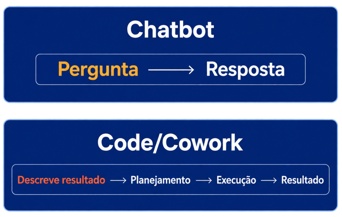
```
:::

## O QUE MUDOU EM TÃO POUCO TEMPO? 

<br>

::: {.incremental}

- Em 2026, a discussão é sobre **delegar tarefas inteiras** à IA: buscar dado, tratar, analisar, gerar relatórios, etc.
- **2025-2026** — **Agentes**: Claude Code e Claude Cowork abrem arquivo, rodam código, navegam, entregam o arquivo pronto.
- A velocidade dessa mudança é o motivo desta palestra ter sido praticamente reescrita do zero.
- O ChatGPT praticamente já está obsoleto para o dia a dia profissional. Ainda serve para fazer cards, imagens, etc. 
:::

## ASSISTENTE X AGENTE

<br>

:::: columns
::: {.column width="50%"}
**Assistente (2023-2024)**

- Você pergunta, ele responde
- Você copia a resposta
- Você mesmo baixa o dado, roda o código, monta o gráfico
:::

::: {.column width="50%"}
**Agente (2025-2026)**

- Você descreve o objetivo
- Ele busca o dado, escreve e roda o código, gera o gráfico. O agente agora executa tarefas dentro do computador do usuário.
- Você revisa e valida o resultado
:::
::::

O economista continua indispensável — mas em outro ponto do processo: **validação e julgamento**, não digitação, não para escrever código.

A automação reduz o trabalho manual, repetitivo e sujeito a erro — isso é **produtividade**. Mas também permite testar mais cenários no mesmo tempo, ampliando o que dá para explorar antes de decidir — isso é **inteligência ampliada**. É a soma das duas coisas que muda o jogo.

## TOKENS COMO INSTRUMENTO DE PRECIFICAÇÃO

:::: columns
::: {.column width="50%"}
```{r}
#| label: figura3

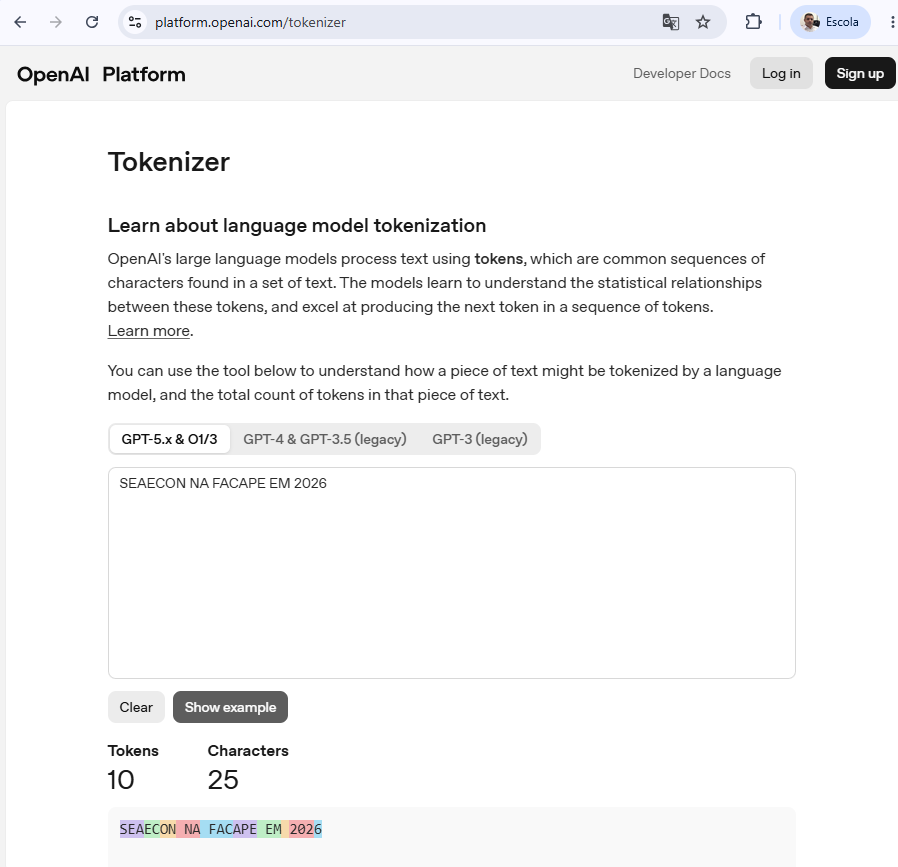
```
:::

::: {.column width="50%"}
```{r}
#| label: figura4
#| out.height: "775px"

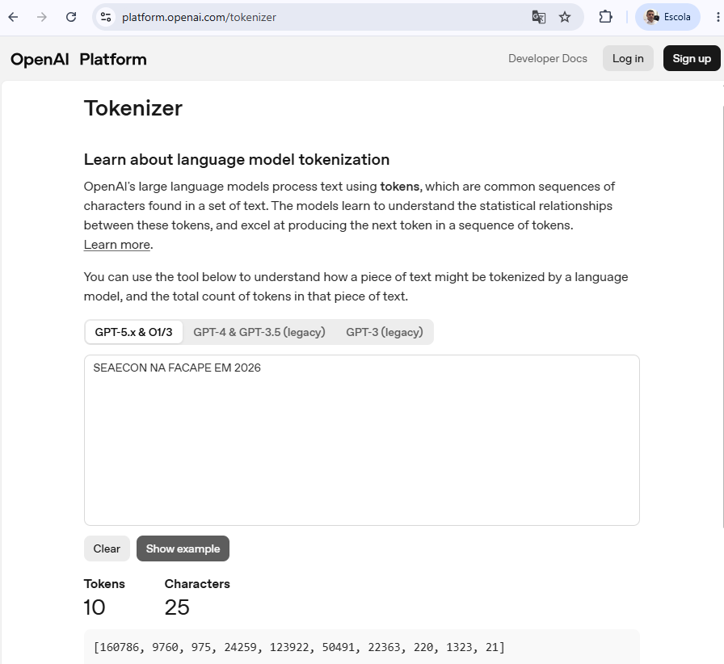
```
:::
::::

# IA NA FORMAÇÃO

## IA NA FORMAÇÃO

:::: columns
::: {.column width="50%"}
<br>
```{r}
#| label: figura5
#| out.height: "650px"
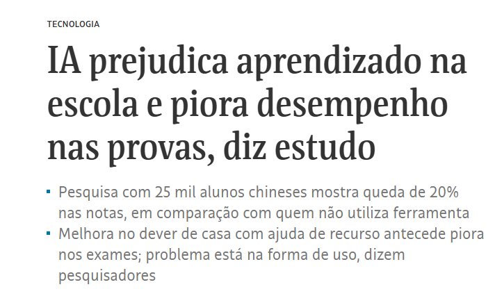
```
:::

::: {.column width="50%"}
<br>
```{r}
#| label: figura6
#| out.height: "620px"
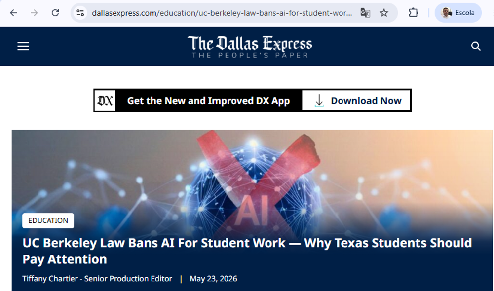
```
:::
::::

## FORMAÇÃO SOB DOIS OLHARES

::: {.incremental}
<br>
A mesma IA muda de papel dependendo de quem está do outro lado da tela:


- **Docente** → a IA como **ferramenta pedagógica versátil**.


- **Aluno** → a IA como **professor particular**.
:::

## O docente: IA como ferramenta pedagógica versátil

::: {.incremental}
<br>

- **Atualização de dado** — macro, economia brasileira, econometria, economia do trabalho, comércio exterior: o livro nunca acompanha a série.
- **Simulação** — microeconomia: gerar cenário e gráfico na hora ("e se o governo taxar X?"), em vez de slide estático.
- **Síntese e conexão passado-presente** — história econômica: sintetizar fonte longa, comparar crise atual com episódio histórico análogo.
:::

## EXEMPLO 1: O PROBLEMA DO DADO DEFASADO

::::: columns
:::: {.column width="50%"}
<br>

- Livro de macroeconomia e de economia brasileira contemporânea nunca está com o dado mais recente — o livro é publicado, o dado muda.

- Resultado tradicional: professor explica um conceito atual com um exemplo de anos atrás.

- Isso é ainda mais sensível em disciplinas que dependem de conjuntura: inflação, câmbio, PIB, mercado de trabalho.
::::

:::: {.column width="50%"}
<br>
<br>

::: {.prompt-box}
[💡 Exemplo de prompt para o agente de IA]{.prompt-label}

"Busque a série do PIB real do Brasil (variação % ao ano) desde 1970 — use a API do SGS do Banco Central (ou IBGE/IPEADATA, caso o BCB não cubra todo o período). Baixe os dados, organize em uma tabela com ano e variação do PIB, e gere um gráfico de linha temporal. Destaque com faixas sombreadas e rótulos os seguintes períodos: Milagre Econômico (1968–1973), Década Perdida (1980–1989), Lula 1 e 2 (2003–2010), Dilma (2011–2016), Temer (2016–2018), Bolsonaro e pandemia (2019–2022), Lula 3 (2023–atual). Salve o script em R (ou Python) e exporte o gráfico em PNG com fundo transparente, pronto para o slide."
:::
::::
:::::

## Por trás do resultado: o agente em ação (1/3)

:::: columns
::: {.column width="50%"}
O agente relê o próprio gráfico, encontra sozinho o problema e edita o código para corrigir.
```{r}
#| label: figura7
#| out.height: "620px"
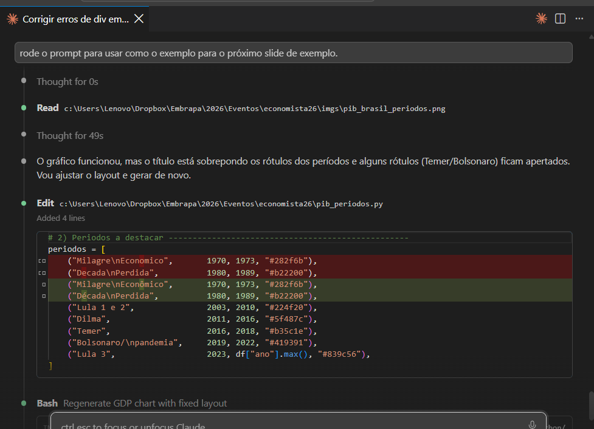
```
:::

::: {.column width="50%"}
Ele roda o comando para re-renderizar a apresentação inteira e resume exatamente o que mudou.
```{r}
#| label: figura8
#| out.height: "620px"
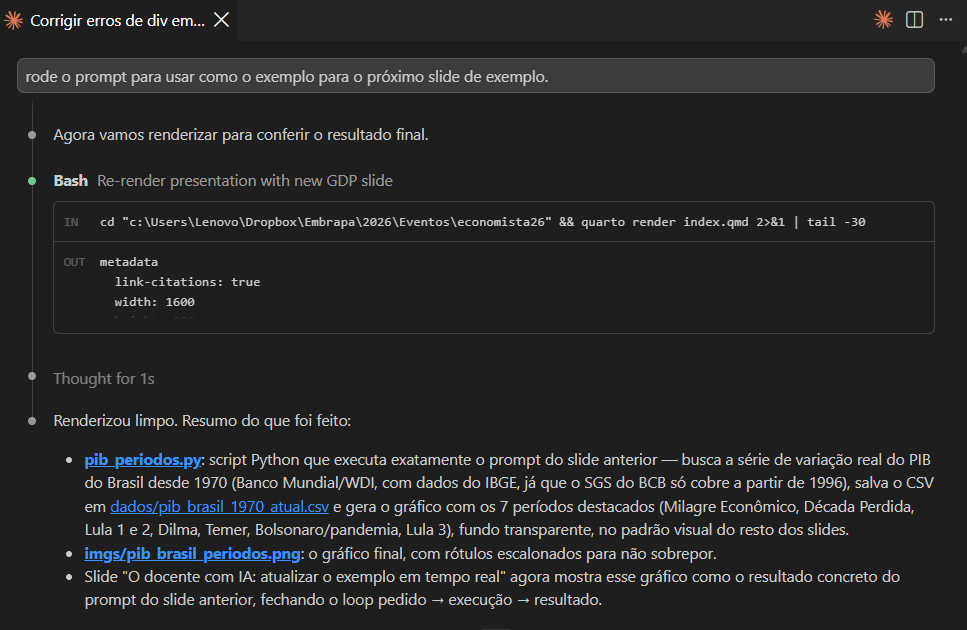
```
:::
::::

## Por trás do resultado: o código gerado (2/3)

:::: columns
::: {.column width="40%"}
<br>
O script Python final — escrito, revisado e corrigido pelo próprio agente — salvo no projeto, pronto para rodar de novo no próximo boletim ou na próxima aula.
:::

::: {.column width="60%"}
```{r}
#| label: figura9
#| fig.align: "center"
#| out.height: "700px"

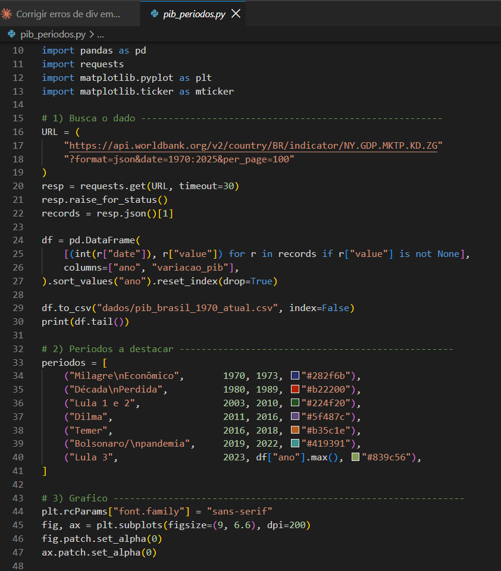
```
:::
::::

## O docente com IA: atualizar o exemplo em tempo real (3/3)

:::: columns
::: {.column width="50%"}
<br>

- Resultado do prompt de dois slides atrás: o agente buscou o dado, tratou a série e gerou o gráfico ao lado — pronto para discutir **na própria aula**.
- O ganho não é só de atualização — é de **tempo de preparo de aula** redirecionado para discussão, não para trabalho manual de planilha.
:::

::: {.column width="50%"}

```{r}
#| label: figura_pib
#| fig.align: "center"
#| out.height: "620px"

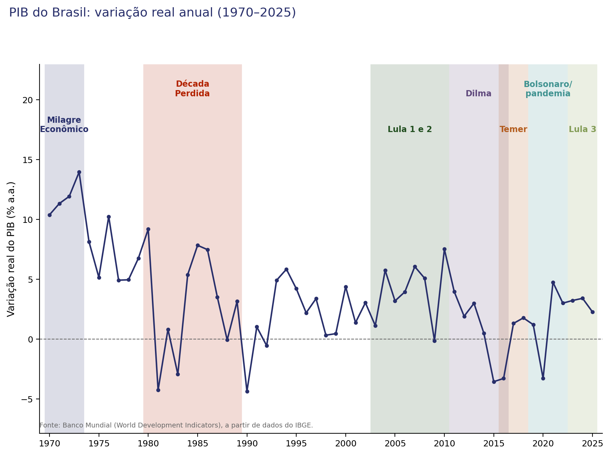
```
:::
::::

## O ALUNO: A IA COMO PROFESSOR PARTICULAR

<br>

:::: columns
::: {.column width="50%"}

- Disponível a qualquer hora, sem constrangimento em perguntar de novo
- Reexplica o mesmo conceito de formas diferentes até fazer sentido
- Simula exercício, prova, estudo de caso
- Dá feedback imediato em redação econômica e em interpretação de dado
:::

::: {.column width="50%"}
```{r}
#| label: figura10
#| out.height: "660px"
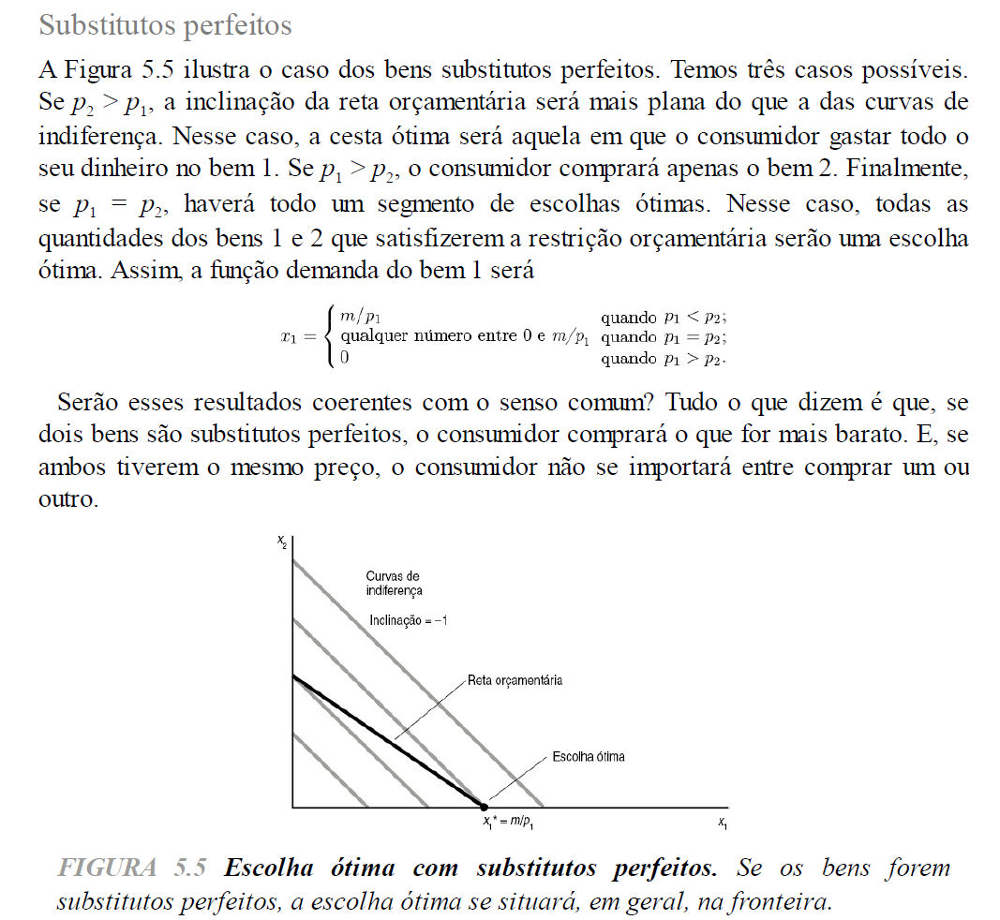
```
:::
::::

## O ALUNO: A IA COMO PROFESSOR PARTICULAR

::::: columns

:::: {.column width="40%"}
<br>

::: {.prompt-box}
[💡 Prompt do aluno]{.prompt-label}

"Leia a imagem `imgs/figura10.png` (página de livro-texto de microeconomia, Figura 5.5, sobre bens substitutos perfeitos). Me explique em linguagem simples: (1) o que significa dizer que dois bens são substitutos perfeitos; (2) por que a escolha ótima do consumidor muda dependendo de p1 ser maior, menor ou igual a p2; (3) o que a função de demanda por partes (x1) está dizendo em cada um dos três casos; e (4) dê um exemplo do dia a dia (fora do livro) de dois bens substitutos perfeitos, relacionando com a inclinação da reta orçamentária e das curvas de indiferença no gráfico."
:::
::::


:::: {.column width="60%"}
<br>

::: {.answer-box}
[✅ Resposta da IA]{.answer-label}

- **Substitutos perfeitos**: o consumidor troca uma unidade do bem 1 por uma do bem 2 sem perder satisfação — por isso as curvas de indiferença são retas com inclinação −1.
- Como essa inclinação é fixa, a escolha ótima é sempre **de canto**: o consumidor gasta tudo no bem mais barato.
  - p1 < p2 → compra só o bem 1 (x1 = m/p1)
  - p1 > p2 → compra só o bem 2 (x1 = 0)
  - p1 = p2 → indiferente entre qualquer combinação (todo o segmento da reta orçamentária é ótimo)
- **Exemplo do dia a dia**: duas marcas de água mineral com o mesmo gosto para você — sempre compra a mais barata; se o preço empatar, tanto faz qual escolher.
- **No gráfico**: a reta orçamentária toca a curva de indiferença mais alta exatamente no eixo (no canto), não no meio — é isso que a função por partes está descrevendo.
:::
::::
:::::

## O PADRÃO POR TRÁS DOS DOIS EXEMPLOS

<br>

::: {.incremental}
- No PIB e nos bens substitutos, o agente fez o trabalho técnico: buscar, tratar, redigir, explicar passo a passo.
- O humano manteve o que só ele pode fazer: decidir a pergunta certa e checar se a resposta faz sentido.
- Isso não é só **economizar tempo** (produtividade) — é também poder testar mais cenários no mesmo tempo, antes de decidir (**inteligência ampliada**).
- É a diferença entre conversar bem com a IA (2024) e orquestrar um agente que executa (2026).
:::

## O ALUNO: ATENÇÃO NECESSÁRIA

<br>

::: {.incremental}
- Professor particular também pode virar **atalho para não pensar**.

- O ganho depende de como o aluno usa: pedir a resposta pronta x pedir para ser guiado até a resposta.

- Papel do docente muda: menos "dar a resposta certa", mais **ensinar a perguntar bem e a checar o que a IA respondeu**.
:::

# IA NA ATUAÇÃO PROFISSIONAL

## EXEMPLOS REAIS DE TRABALHO EM ANDAMENTO

<br>

Em vez de exemplos genéricos, alguns casos do que venho trabalhando atualmente na FACAPE e na Embrapa:

1. Custo da Cesta Básica
2. Observatório da Manga e da Uva

## CUSTO DA CESTA BÁSICA

::: columns
::: {.column width="50%"}

<br>

- Projeto iniciado no Colegiado de Economia da FACAPE em 2013 e tem periodicidade mensal. 
- Participação de professores e alunos.

- Apoio institucional garantiu a coleta de dados em Petrolina/PE e Juazeiro/BA todos os meses. Apenas na pandemia em 2020 a pesquisa foi suspensa por 5 meses (março a julho).

- Projeto com impacto social e com divulgação da instituição na mídia.


:::
::: {.column width="50%"}

<br>

- Trabalho de visita a 46 estabelecimentos comerciais na soma de Petrolina/PE com Juazeiro/BA, pelo menos 2 vezes no mês. 

- Em julho/2026 foram 1.475 informações de preços inseridos manualmente pelos alunos nas planilhas. 

- Checagem por amostragem das informações inseridas e por estatísticas descritivas. Alteração na quantidade e nome dos estabelecimentos comerciais gerava necessidade de alteração das fórmulas inseridas nas planilhas.

:::
:::

## CESTA BÁSICA: COMO ERA, MÊS A MÊS {.titulo-pequeno}

<br>

::: {.incremental}
- Máximo, mínimo e média calculados **em fórmula dentro da própria planilha** — frágil: mudou o nome ou o número de estabelecimentos, alguém tinha que lembrar de ajustar a fórmula à mão.
- Boletim mensal escrito e diagramado **no Word**, do zero, todo mês.
- Juntar a série desde 2013 para calcular um índice era um trabalho manual à parte, feito fora da planilha.
- Sem dashboard — só o PDF do boletim, quando ficava pronto.
:::

## HOJE: TRÊS ARQUIVOS ENTRAM {.titulo-pequeno}

<br>

O que eu ainda faço, todo mês:

1. Baixo a planilha de **Petrolina/PE** do Google Drive.
2. Baixo a planilha de **Juazeiro/BA** do Google Drive.
3. Salvo o PDF do **DIEESE** (referência nacional, 27 capitais), baixado mensalmente do site deles.

Esses três passos poderiam virar automáticos, sem precisar baixar nada manualmente.

<br>

Do resto — validar, calcular, escrever o boletim, atualizar o dashboard — quem cuida é o agente.

## O QUE O AGENTE FAZ SOZINHO {.titulo-pequeno}

<br>

Um clique no `gerar_boletim.ps1` roda tudo em sequência:

::: {.incremental}
1. **Valida** as duas planilhas antes de qualquer cálculo (linha certa? nenhum estabelecimento faltando?)
2. **Extrai** os preços da cesta dos 46 estabelecimentos
3. **Extrai** os dados do PDF nacional do DIEESE
4. **Reconstrói a série histórica completa**, desde 2013, sem hiato
5. **Calcula o índice ICB** próprio do Vale do São Francisco e gera o gráfico
6. **Monta o boletim do mês** a partir do template do mês anterior — texto e gráfico já dinâmicos
7. **Renderiza o PDF** e **atualiza o dashboard** publicado
:::

## UM ERRO QUE NÃO SE REPETE MAIS {.titulo-pequeno}

::: columns
::: {.column width="50%"}

<br>

**Antes**

- A fórmula de máx/mín vivia dentro da planilha, escondida
- Se alguém adicionava ou removia um estabelecimento, a fórmula não se ajustava sozinha
- O erro só aparecia quando o número já estava errado no boletim publicado

:::
::: {.column width="50%"}

<br>

**Hoje**

`valida_planilhas.py` faz **duas conferências**, antes de qualquer conta:

1. **Todo preço está na linha certa?** A planilha segue um padrão fixo (produto → preço → linha em branco); se um preço foi digitado fora do lugar, o script aponta exatamente onde.
2. **Nenhum estabelecimento ficou de fora?** Confere se toda loja visitada realmente entrou no cálculo final — não parte dela por descuido.

Erro de estrutura é pego **na validação**.

:::
:::

## A SÉRIE HISTÓRICA, RECONSTRUÍDA TODO MÊS {.titulo-pequeno}

```{r}
#| label: figura_icb
#| fig.align: "center"
#| out.height: "620px"

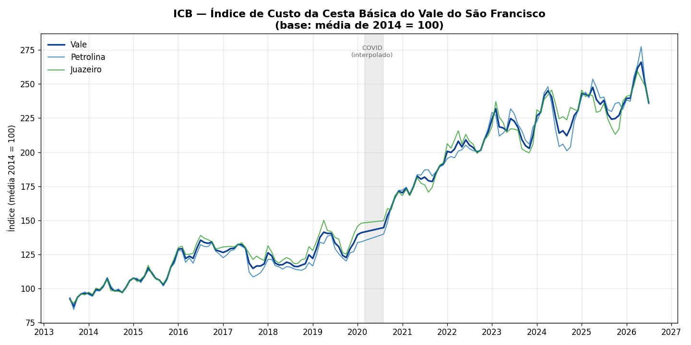
```

## O ÚNICO PASSO QUE CONTINUA MANUAL {.titulo-pequeno}

<br>

::: {.incremental}
- Depois de calcular tudo, o script **abre o Notepad automaticamente** e espera.
- É o único momento do processo inteiro em que alguém precisa escrever alguma coisa.
- O que entra ali: **por que** o preço de certos produtos subiu ou caiu naquele mês — a leitura de conjuntura que nenhum script calcula sozinho.
- Validação, extração, série histórica, índice, boletim, dashboard: o agente resolve. **Explicar o porquê é do economista.**
:::

## A NOVIDADE: DASHBOARD PÚBLICO {.titulo-pequeno}

::: columns
::: {.column width="40%"}

<br>

- Antes, o único produto final era o PDF do boletim.
- Hoje existe um **dashboard interativo**, publicado no GitHub Pages, atualizado a cada rodada do script.
- Série histórica navegável, gráfico do índice ICB, tabela exportável — sem esperar o próximo boletim para consultar o dado.

:::
::: {.column width="60%"}

```{r}
#| label: figura_icb2
#| fig.align: "center"
#| out.height: "760px"

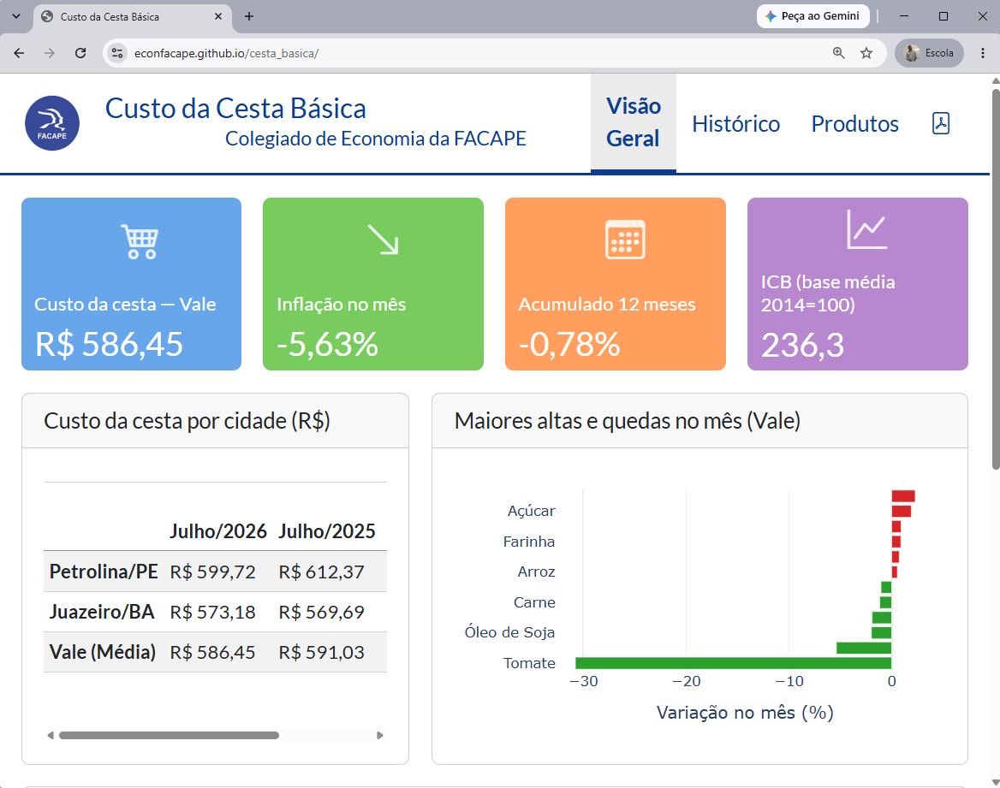
```
:::
:::

## ANTES x DEPOIS: O BOLETIM DA CESTA BÁSICA {.titulo-pequeno}

| Etapa | Antes | Agora |
|---|---|---|
| Cálculo de máx/mín/média | Fórmula na planilha, quebrava ao mudar estabelecimento | Script valida e calcula direto |
| Série histórica (desde 2013) | Montada à parte, manualmente | Reconstruída automaticamente, sem hiato |
| Índice ICB e gráfico | Não existia como rotina | Calculado e gerado todo mês |
| Boletim | Escrito e diagramado no Word | Gerado por template, `.qmd` → PDF |
| Consulta ao dado | Só no PDF do boletim | Dashboard público, sempre atualizado |
| Economista escreve | Todo o boletim | Só a explicação de conjuntura |

Um sinal concreto dessa transição: até abril/2026, cada boletim publicado tinha uma versão em **Word** por trás do PDF. A partir de maio/2026, só o PDF pelo pipeline.

## OBSERVATÓRIOS DA MANGA E DA UVA

<br>

- Iniciativa da Embrapa Semiárido, desde 2020, para apoiar a decisão do produtor de manga e de uva do Vale do São Francisco.
- Acompanha mercado externo (volume, receita e preço de exportação) e mercado interno (preço semanal — mínimo, máximo, médio — das variedades Tommy e Palmer, Uvas Brancas e Negras sem sementes).
- Estrutura de boletim recorrente: mesma pergunta, mesma fonte, período diferente — exatamente o tipo de tarefa repetitiva onde um agente de IA ajuda mais.


## AS FONTES DE DADOS

::: columns
::: {.column width="50%"}

<br>

**Portais e sites institucionais**

- IBGE (PAM, SIDRA, CEMPRE)
- CEPEA/ESALQ
- MAPA, COMEXSTAT
- FAO, COMTRADE
- Banco Central do Brasil (SGS)
- NASA POWER (dados climáticos)
- IPEADATA

:::
::: {.column width="50%"}

<br>

**O problema real**

- Dados **dispersos** em diferentes portais
- Formatos **diferentes**: CSV, XLS, JSON, HTML
- Frequências **diferentes**: semanal, mensal, anual
- Chegam em **ritmos diferentes** — alguns por email toda semana, outros uma vez por ano

:::
:::

## FONTES VIA EMAIL E APIs

::: columns
::: {.column width="50%"}

<br>

**Boletins e cotações por e-mail**

- Boletins semanais de preços chegam diretamente na caixa de entrada
- Exemplo: CEPEA manga, CEPEA uva, a empresa Forever disponibiliza dados de conteineres exportados de mangas por semana para a União Europeia e Reino Unido.
- Precisam ser extraídos, padronizados e incorporados à base existente

:::
::: {.column width="50%"}

<br>

**Application Programming Interface**

- Banco Central do Brasil (SGS)
- IBGE/SIDRA
- NASA POWER
- IPEADATA
- Permitem acesso direto e atualização automatizada

:::
:::

## QUANDO NÃO HÁ API: SCRAPING {.titulo-pequeno}

::: columns
::: {.column width="50%"}

<br>

**O problema: site sem API**

- Exemplo: **National Mango Board** (nmb-database.com) — dados de volume e preço FOB de manga importada pelos EUA, por país de origem
- O site só entrega os dados por um formulário web (sem API pública)
- Antes: baixar pelo navegador, abrir e limpar no Excel — processo manual, repetido toda semana
- Risco real: o Excel **corrompia as datas** na abertura/salvamento

:::
::: {.column width="50%"}

<br>

**A solução: reproduzir o formulário via código**

```r
resp <- httr::POST(
  "https://nmb-database.com/cropreports2/
   reportgeneratevolume.php",
  body = corpo_do_formulario,
  encode = "raw"
)
# extrai o link "Export to Excel" da resposta
# e baixa o arquivo automaticamente
```

- O script envia exatamente o mesmo POST que o formulário do site faz
- Sem navegador, sem Excel, sem corrupção de dados
- Roda todo mês junto com a atualização do dashboard

:::
:::

## DE MANUAL PARA AUTOMÁTICO {.titulo-pequeno}

::: columns
::: {.column width="50%"}

**Por muito tempo: alimentação manual**

- Copiar e colar de emails
- Digitar de tabelas em sites
- Baixar arquivos manualmente, renomear, mover para a pasta certa

**Consequências**

- Sujeito a erro humano (digitação, unidade errada, linha pulada)
- Trabalhoso e repetitivo
- Difícil de escalar conforme o número de variáveis cresce

:::
::: {.column width="50%"}

**Hoje: automação**

- **Leitura automática de emails**: boletins de CEPEA chegam toda sexta-feira e são processados automaticamente por um assistente de IA que lê o email, extrai os dados e os incorpora à base
- **Download via APIs**: Banco Central, IBGE, NASA POWER, etc — dados puxados diretamente no código, sem intervenção manual

:::
:::

## AUTOMAÇÃO NA PRÁTICA {.titulo-pequeno}

::: columns
::: {.column width="50%"}

<br>

**Exemplo: leitura de email**

Toda sexta-feira chegam boletins de preços. Com automação:

1. Email é lido automaticamente
2. Dados extraídos e validados
3. Incorporados ao CSV existente
4. Processo registrado com data e hora

**Antes**: 15–20 minutos por boletim, risco de erro

**Hoje**: automático, auditável

:::
::: {.column width="50%"}

<br>

**Exemplo: API do Banco Central**

```python
import requests
url = ("https://api.bcb.gov.br/dados/serie/"
       "bcdata.sgs.1/dados"
       "?formato=json"
       "&dataInicial=01/01/2024"
       "&dataFinal=31/12/2024")
dados = requests.get(url).json()
```

Dados de câmbio diário, atualizados automaticamente, sem copiar uma célula sequer.

:::
:::

## Antes x Depois

| Etapa | Antes (manual) | Agora (com IA agente) |
|---|---|---|
| Coleta de dado | Baixar planilha fonte a fonte | Agente busca e organiza |
| Tratamento | Ajustar formato, mesclar bases | Agente executa o script |
| Gráfico/tabela | Montar peça a peça | Agente gera a partir do pedido |
| Análise | Escrever do zero | Economista revisa e refina |

O tempo poupado nas três primeiras linhas é reinvestido na última — que é a que exige o economista.

Menos erro, processo documentado e reproduzível — **produtividade**

<!-- TODO: incluir um número real de ganho de tempo (ex.: "boletim que levava X horas agora leva Y minutos") para dar peso concreto à palavra "produtivo" -->

## PREVISÃO DE PREÇOS: A BUSCA PELO MELHOR MODELO {.titulo-pequeno}

<br>

::: {.incremental}
- No caso da Manga, três modelos disputam toda semana: **AutoARIMA**, **XGBoost** e um **Ensemble** (combinação) dos dois — nenhum entra por padrão, cada um precisa provar que é melhor.
- Cada especificação nova é validada em pelo menos **20 janelas de rolling-origin** — não basta ganhar no ajuste dentro da amostra, tem que ganhar prevendo fora dela, repetidamente.
- A diferença entre modelos só é aceita com **teste de Diebold-Mariano** (estatisticamente significativa) — ganho pequeno sem significância é tratado como ruído, não como melhoria.
- O teste de **Pesaran-Timmermann** confere se o modelo acerta a *direção* (sobe ou desce), não só o valor.
- Variáveis em uso hoje: sazonalidade por termos de Fourier, índice climático El Niño, câmbio e clima local (dias quentes/frios, chuva) — diferentes para Palmer e para Tommy.
:::

## NEM TUDO QUE TESTAMOS FICOU {.titulo-pequeno}

<br>

Rigor também é saber descartar. Testado e **rejeitado** com evidência, não por achismo:

::: {.incremental}
- Variável de ciclo de preço ("cobweb") — ganho de só 0,2–0,3%: ruído.
- "Momentum" no XGBoost — piorou 5,5 a 9,8%.
- Modelo Theta no ensemble — piorou **40%** para o Tommy.
- Rede neural NHITS (Interpolação Hierárquica Neural para Séries Temporais) — sobreajustou aos dados.
- Clima dos concorrentes externos (México, Equador, Peru) — o teste mais elaborado de todos.
:::

## O TESTE DO CLIMA DOS CONCORRENTES {.titulo-pequeno}

A hipótese, do conhecimento de mercado: quando México ou Equador têm quebra de safra por clima, a demanda dos EUA migra para o Brasil — menos fruta no mercado interno, preço sobe. Cada concorrente domina uma janela do ano:

| Semanas | Concorrente | Mercado |
|---|---|---|
| 21–31 | México | EUA |
| 38–46 | Equador | EUA |
| 47–52 e 1–20 | Peru | Europa |

::: {.incremental}
1. **Anomalia climática, sem interação** — sinal real apareceu, mas com dois vícios: vazamento de dado futuro e tendência disfarçada de anomalia.
2. **Climatologia expansiva + interação sazonal** — corrigiu os vícios; Equador mostrou correlação forte (p < 0,001) dentro da amostra, mas **nenhuma das 32 especificações** passou no Diebold-Mariano fora da amostra.
3. **Janela do México corrigida** (21–31, não 31–37, por conhecimento de mercado) — inverteu o sinal para a direção esperada e produziu o primeiro resultado aparentemente positivo do estudo.
:::

## O PLACAR REAL, SEMANA A SEMANA {.titulo-pequeno}

<br>

| Semana-alvo | Palmer: previsto | Palmer: real | Tommy: previsto | Tommy: real |
|---|---|---|---|---|
| 03/07 | 2,81 | 2,99 ✅ | 4,68 | 5,18 ✅ |
| 17/07 | 3,21 | 3,68 ❌ | 4,29 | 4,19 ✅ |
| 31/07 | 3,82 | 3,75 ✅ | 3,15 | 2,53 ❌ |
| 07/08 | 3,77 | 3,58 ✅ | 2,04 | 3,12 ❌ |


<br>
Duas semanas acertando as duas variedades, duas semanas acertando uma e errando a outra — nunca as duas erradas ao mesmo tempo. O modelo é bom para pegar viradas (69–71% de acerto de direção), mas erra quando o preço mantém uma tendência forte — como a Palmer, que subiu direto de 2,77 para 3,80 em cinco semanas.

# RISCOS, LIMITES E O PAPEL DO ECONOMISTA

## O QUE NÃO MUDA

<br>

::: {.incremental}
- IA pode **alucinar**: gerar número ou afirmação que parece plausível e está errada.
- Modelo carrega **viés** dos dados com que foi treinado.
- Agente executa o que foi pedido — não valida sozinho se o resultado faz sentido economicamente.
- A responsabilidade técnica e ética sobre o resultado publicado continua sendo do economista, não da IA.
- Mesmo assim, usado com julgamento, o agente expande o que um único economista consegue testar e analisar em um dia — não substitui o julgamento, **multiplica o alcance dele**.
:::

## O QUE ESTÁ ERRADO NA FIGURA?

```{r}
#| label: figura11
#| fig.align: "center"

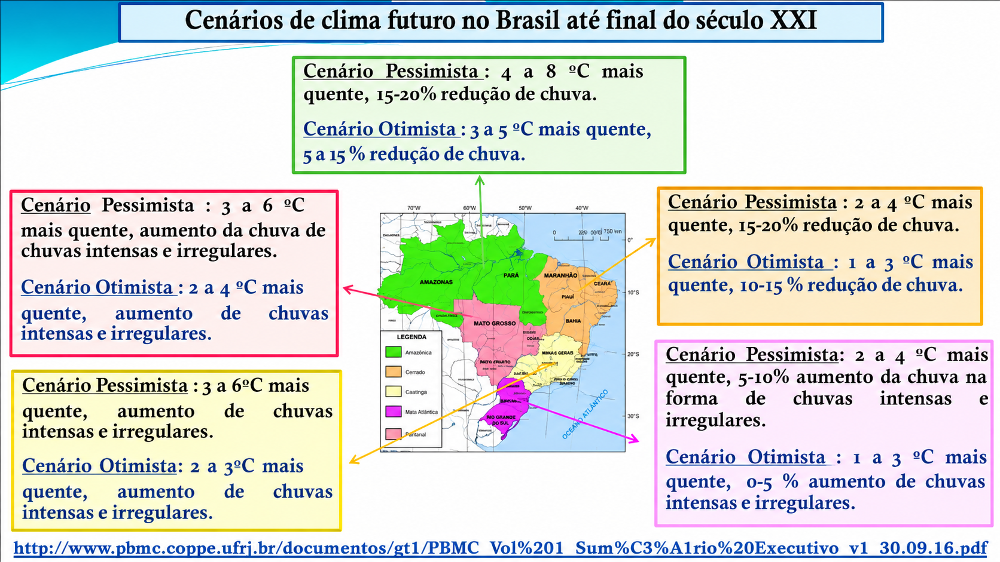
```


## SÍNTESE

<br>

> A IA não substitui o economista. Mas o economista que usa IA tende a substituir, no mercado de trabalho, o que não usa.

- Na formação, muda o papel do aluno (de decorar para questionar) e do docente (de preparar material estático para atualizar em tempo real).
- Na atuação profissional, muda o que ocupa o tempo do economista: menos tarefa repetitiva, mais julgamento e validação.

## {.center .thankslide}

::: columns
::: {.column width="50%"}

<br>
<br>

<div style="text-align: center;"> 
  <h2 style="color: #282f6b; font-size: 2.5em; margin-bottom: 20px;">
    MUITO OBRIGADO!
  </h2>
  <br>
  <!-- This part will have a smaller font size -->
    <br>
📲 **WhatsApp Coordenação Economia:** <br>
+55 87 99135-2758
<br>
<br>
<br>

coord.economia@uni.facape.br
  </p>
</div>

:::
::: {.column width="50%"}


```{r}
#| label: figura12
#| fig.align: "center"
#| out.width: "90%"


```
:::
:::